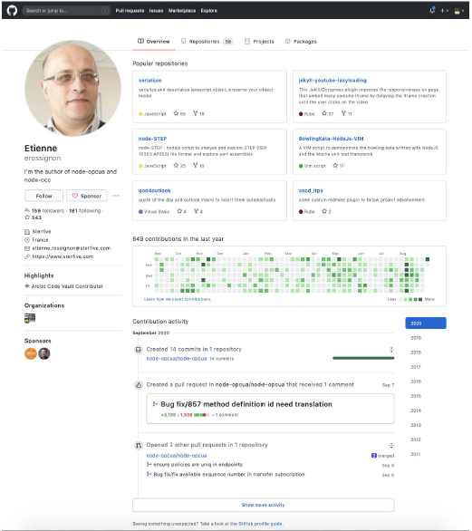

# Assignment: Design an Angular app for below UI.

## Follow below instructions

1. Design the following UI:

    
    
2. API Integration: 
    1. Integrate the contribution part using github api. Basically the total contributions and the heatmap plot(green color).
    2. Integrate the user profile info api to fetch the details show them as below in the left panel.
    3. Reference https://docs.github.com/en/rest/reference
3. Make sure the tabs(Repositories, Projects, Packages) are working. The other tabs don't need to have any content under them.
4. Design the UI as close as possible to the attached design.
